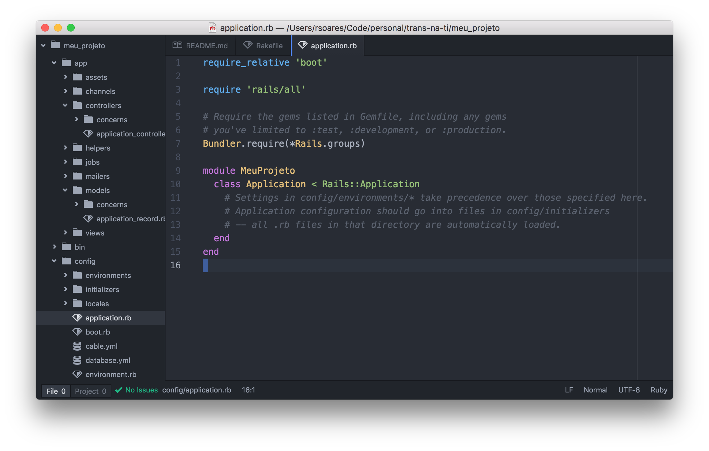

# Editores de Texto

Para escrevermos nosso código utilizaremos um editor de texto apropriado para
tal. Existem diversos editores que podem ser utilizados, mas neste capítulo
falaremos um pouco do Atom, que será utilizado nos próximos exemplos,
mas nada impede a utilização de outro editor de sua preferência. Outras
opções de editores são apresentadas ao final do capítulo.

## Atom

O Atom é um editor de textos de código aberto disponível para Windows, Mac OS e
Linux. Pode ser baixado gratuitamente na página do projeto:
[https://atom.io/](https://atom.io/)

Aqui uma captura de tela de um projeto utilizando o Atom:

Ao lado esquerdo os arquivos e pastas do diretório, ao lado direito um arquivo
aberto para edição.

### Atalhos

Em seguida alguns atalhos úteis que te ajudaram a utilizar o editor:

| Atalho (Windows e Linux) | Atalho (Mac) | Descrição |
| --- | --- | --- | --- |
| `ctrl-p` | `cmd-p` | Busca e abre um arquivo a partir de um nome |
| `crtl-n` | `cmd-n` | Cria um novo arquivo |
| `ctrl-s` | `cmd-s` | Salva o arquivo atual |
| `ctrl-shift-s` | `shift-cmd-s` | Salva o arquivo atual com outro nome |
| `ctrl-w` | `cmd-w` | Fecha a aba atual |
| `ctrl-f` | `cmd-f` | Abre o recurso de busca e substituição |
| `ctrl-/` | `cmd-/` | Comenta ou descomenta uma linha ou texto selecionado |

Existem outros editores disponíveis no mercado, alguns exemplos:

* [Notepad++](https://notepad-plus-plus.org/)
* [Sublime Text](https://www.sublimetext.com/)
* [Vim](http://www.vim.org/)
* [Visual Studio Code](https://code.visualstudio.com/)
